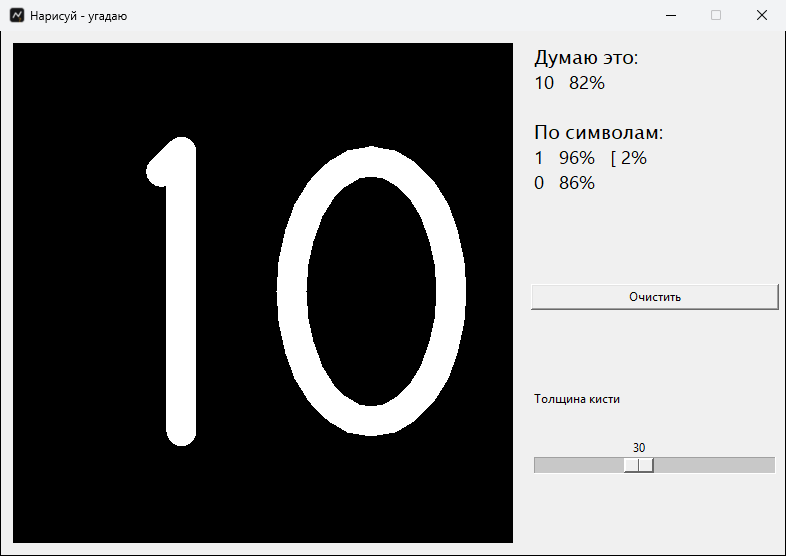

<div align="center">

# DrawGuess

**Draw with the mouse on a black canvas and a PyTorch convolutional network says what it is. Digits, letters, shapes, everyday objects and maths symbols; several symbols in a row are read as a number or a string.**

[Download for Windows](https://github.com/ALEXalesha/IntelegienceDrawer/releases/latest) &nbsp;·&nbsp; [Русская версия этого файла](README.ru.md)

[](https://github.com/ALEXalesha/IntelegienceDrawer/actions/workflows/ci.yml)
[](https://github.com/ALEXalesha/IntelegienceDrawer/releases/latest)
[](LICENSE)



</div>

> **The interface is in Russian.** In the screenshot above, "Думаю это" means "I think it is" and "По символам" means "symbol by symbol". The class labels for objects are Russian too.

## What it knows

One classifier trained on four sources at once:

| Source | What it gives | Classes |
| --- | --- | --- |
| EMNIST (byclass) | digits `0-9`, letters `A-Z`, `a-z` | 62 |
| Quick, Draw! (Google) | shapes and objects: circle, square, star, cat, house, tree, car, plane… | 25 |
| synthsigns (generated on the fly) | `+ − = × ÷ ( ) [ ] < >` | 11 |
| HASYv2 | maths symbols: `± ≠ ≤ ≥ ≈ √ ∑ ∫ ∂ ∇ → ∈ ∪ ∩ ∀ ∃ π ∞`… | ~70 |

The final label list lives in `labels.json`.

## How it works

```
drawing on a 500×500 canvas
        │
        ▼
preprocess.normalize()   crop to the ink → scale the long side to 20 px
        │                → centre inside a 28×28 frame (the classic MNIST framing)
        ▼
   SketchNet (CNN)        3 convolution blocks + 2 dense layers, dropout
        │
        ▼
   softmax → top guesses with percentages
```

The point worth copying: **the live drawing and the training data go through the same `normalize()`**, so the two distributions cannot drift apart. That single shared function is why a drawing made in the corner of the canvas gives the network the same input as one made in the middle.

## Several symbols: numbers and strings

The network is trained on single symbols. Until 1.1 the whole canvas went into it as one 28×28 frame, so "65" came out as "W". Now the drawing is cut into symbols first (`segment.py`):

1. **By strokes.** Every stroke, from press to release, is kept separately. Strokes that overlap horizontally by at least 30 % of the narrower one belong to one symbol, which keeps "=", "i", "÷", "+" and "4" whole while a "6" next to a "5" becomes two symbols. Drawing order does not matter: symbols are read left to right.
2. **Each symbol goes through the same network** and the same `normalize()`.
3. **String rules.** If at least half the symbols are digits, look-alikes are turned into digits (`|`, l, I → 1; `°`, O, o → 0; S → 5; b → 6; Z → 2; B → 8; g, q → 9) and a doubtful symbol becomes the best digit that has at least 10 %. A word with no digits, such as "SOS", is left alone. Case is decided by height, because c, o, s, u, v, w, x and z look identical in both cases once size is normalised away.

The same rules live in the author's other project, AlexGPT, which shares this model.

## Running

```bash
pip install -r requirements.txt
python app.py
```

`model.pt` is in the repository, so nothing has to be trained first. Ready Windows builds - installer and portable - are on the [releases page](https://github.com/ALEXalesha/IntelegienceDrawer/releases/latest); they carry a CPU build of PyTorch, which is why they weigh about 170 MB. The window opens where it was closed (`%APPDATA%\DrawGuess\window.json`); its size is fixed, so only the place is kept.

## Tests

```powershell
build_env\Scripts\python.exe -m pytest tests
```

64 tests, about 50 seconds.

`test_app.py` drives a real window, kept hidden: the window size never changes, not even under the longest possible list of guesses; a stroke lands both on the canvas and in the image the network sees; the brush width works; "clear" resets everything; the same drawing in a different corner produces the same input; the 30 % boundary between "I think it is" and "not sure", the 2 % cut-off and the limit of 8 lines are checked against a stub network with known probabilities; without `model.pt` the window explains what to do.

`test_segment.py` checks the cutting and the string rules: "65" is two symbols while "=", "i", "÷", "+" and "4" are one; drawing order does not matter; over 500 random drawings every stroke ends up in exactly one symbol and symbols come out left to right; a re-rendered symbol matches the drawn one pixel for pixel; "b5" reads as "65", "|°" as "10", "SOS" stays a word; over 2000 random probability sets the confidence stays in [0, 1] and equals the product, and a digit is never swapped for a non-digit. On the real model, drawn "10", "11" and "70" are read exactly so.

Then the tests were checked against deliberate damage: 10 planted bugs in the window and 37 in the cutting and string rules. All 47 were caught.

## Retraining from scratch

1. Download EMNIST (~536 MB) into `~/.cache/emnist/emnist.zip`.
2. Put HASYv2 into `hasy/` (`hasy-data-labels.csv` and the PNGs). Quick, Draw! downloads itself.
3. `python train.py` assembles `assembled_train.npz` / `assembled_test.npz`, trains for 10 epochs and rewrites `model.pt` and `labels.json`.

## Building the Windows binaries

```powershell
powershell -ExecutionPolicy Bypass -File build.ps1
```

The script works inside `build_env`, the project's own environment rather than the system Python: it installs dependencies, runs the tests, builds `dist/DrawGuess.exe` from `DrawGuess.spec`, then `release/DrawGuess-<version>-Setup.exe` (NSIS) and `release/DrawGuess-<version>-portable.zip`.

One trap is worth writing down: `installer.nsi` must be UTF-8 **with** a BOM. With `Unicode true` and no BOM, makensis reads the file as ANSI and the Russian text turns to mojibake. Before 1.0.1 there was no BOM, and the "uninstall DrawGuess" shortcut in the Start menu had an unreadable name.

## Screenshots are generated

`tools/make_screenshot.py` opens the real window, draws "10" through the same mouse handlers a hand would use, and captures the window with `PrintWindow`. A screen grab by window rectangle would be wrong: a window that just opened can sit behind others, and then the shot catches someone else's content. Tkinter widgets have no `grab()` of their own, which is why it goes through the Windows API.

## Stack

Python · PyTorch · NumPy · Pillow · Tkinter · PyInstaller · NSIS

## Licence

MIT, see [LICENSE](LICENSE). The weights in `model.pt` were trained on EMNIST, Quick, Draw!, HASYv2 and generated symbols; those datasets keep their own terms.
